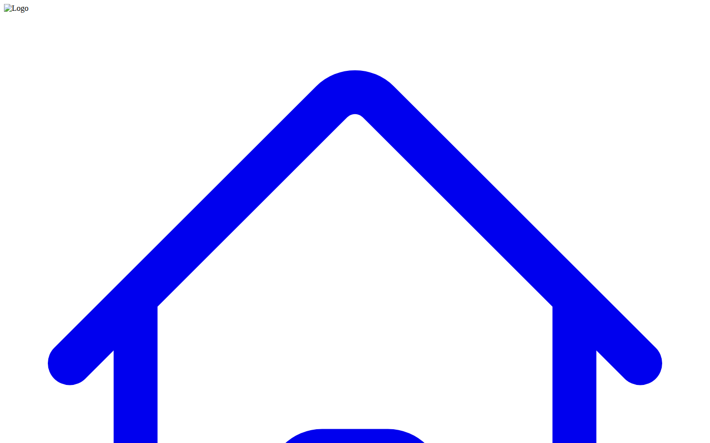

# Portfolio Management Dashboard

A full-featured portfolio management dashboard with multi-page navigation, financial tracking, analytics, and a built-in Smart Assistant — built with React and TypeScript.



## Live Demo

**Live:** [https://kareembullard.github.io/portfolio-dashboard/](https://kareembullard.github.io/portfolio-dashboard/)

`index.html` is the standalone build served directly from GitHub Pages — no build step, no install needed. `portfolio-management-dashboard-react_index.html` is kept alongside it as the original React/Vite source for local development (see below).

## Features

- **Dashboard** — KPIs, active projects, alerts at a glance
- **Projects Page** — Full project list with status and priority
- **Financials** — Budget tracking, cost breakdowns, financial snapshots
- **Analytics** — Performance metrics and trend views
- **Settings** — Configurable preferences
- **Wiki** — Internal knowledge base
- **Smart Assistant** — AI-powered assistant panel for in-app help
- Responsive sidebar navigation
- Mock data layer for easy customization

## Tech Stack

| Layer | Technology |
|---|---|
| Framework | React + TypeScript |
| Styling | Tailwind CSS (via CDN) |
| Build | Vite |
| Icons | Inline SVG + Lucide |

## React Version — Local Setup

**Prerequisites:** Node.js 18+

```bash
npm install
npm run dev
```

## Project Structure

```
├── App.tsx                  # Main layout + page routing
├── Header.tsx               # Top navigation header
├── DashboardPage.tsx        # Dashboard view
├── FinancialsPage.tsx       # Financial tracking view
├── AnalyticsPage.tsx        # Analytics + charts view
├── Alerts.tsx               # Alert management
├── constants.tsx            # Mock project/task/financial data
├── types.ts                 # TypeScript interfaces
├── components/
│   ├── layout/              # Sidebar, navigation
│   ├── dashboard/           # Project cards, modals
│   ├── pages/               # Full page components
│   └── assistant/           # Smart Assistant widget
```

## About

Built by Kareem Bullard as part of the King Projects portfolio — a comprehensive project portfolio manager demonstrating enterprise-style dashboard architecture, multi-page navigation, and financial data visualization.
